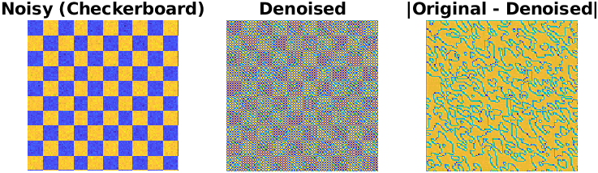
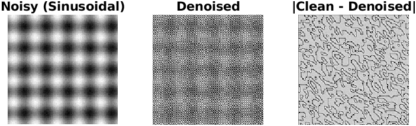
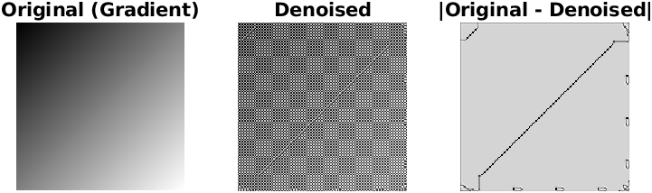
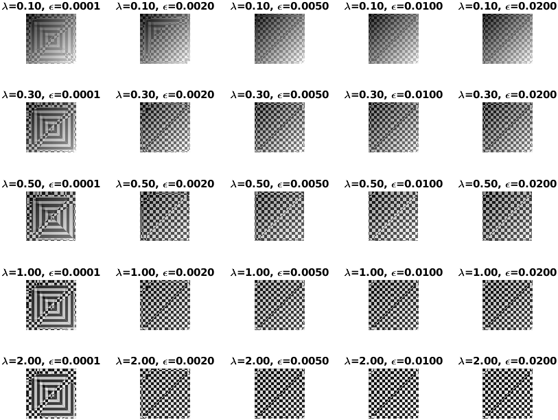
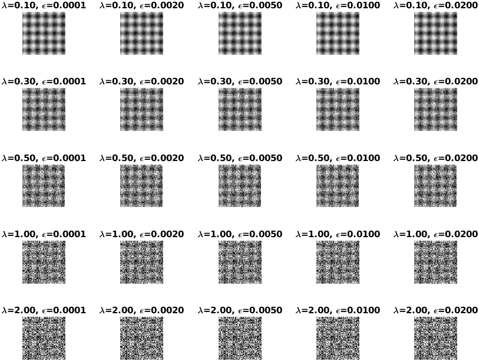
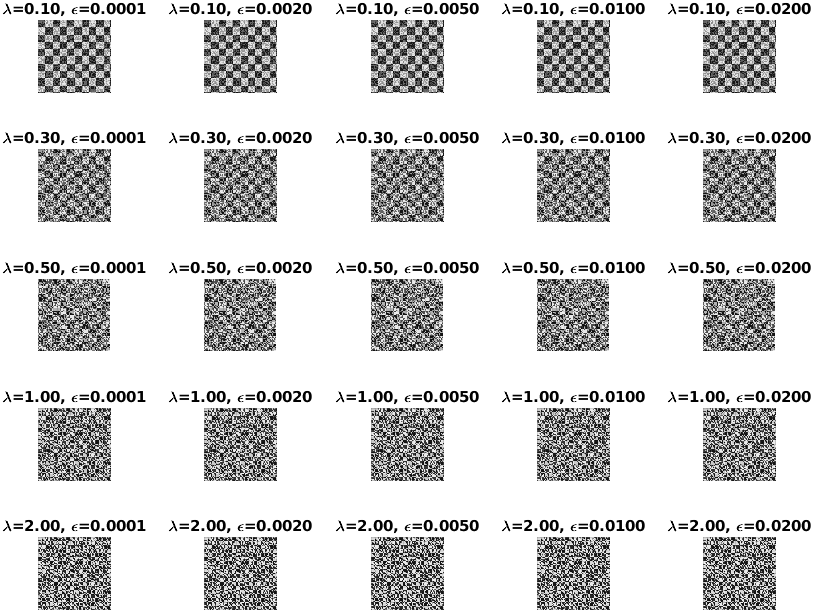
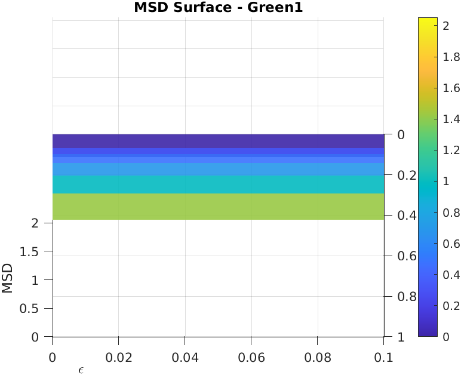
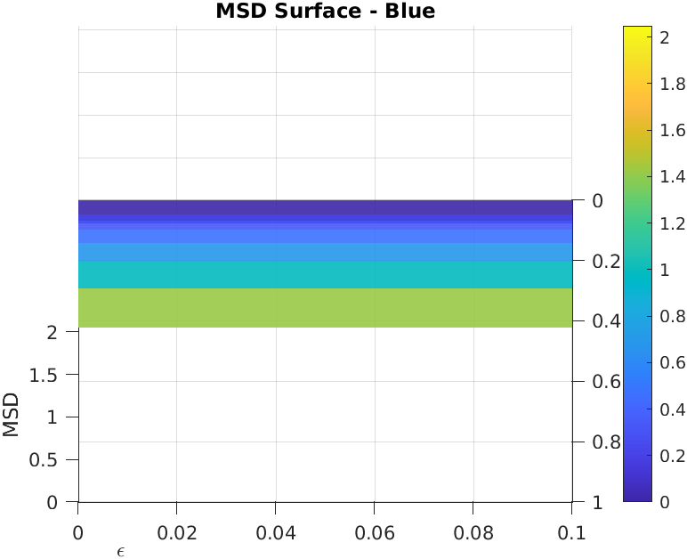

# Image Restoration using the ROF Model

**Joel Maldonado · 2025-05-14**

This repository implements the Rudin–Osher–Fatemi (ROF) total‐variation denoising model, optimized for CPU/GPU hybrid execution and high‐performance parameter sweeps. We apply ROF separately to each Bayer‐mosaic color plane (R, G1, G2, B) and measure noise reduction via the Mean Square Difference (MSD).

---

## 📄 Full Report

You can download the complete PDF report here:

➡️ [Download the report (PDF)](report/r3.pdf)

---

## 🚀 Method Overview

1. **Model & Discretization**  
   Minimize  
   \[
   \mathcal{F}(u) = \int \sqrt{\epsilon^2 + |\nabla u|^2}\,dx\,dy
   + \tfrac\lambda2\int(u-f)^2\,dx\,dy
   \]
   with a finite‐difference scheme and Neumann boundary conditions.

2. **CPU/GPU Solver**  
   - **CPU**: `double` precision, block‐wise sweeps with `parfor`.  
   - **GPU**: `single` precision, 4D parameter stacking with `gpuArray`.

3. **MSD Metric**  
   \[
   \text{MSD}(f,\lambda,\epsilon)
   = \sqrt{\tfrac1{HW}\sum_{i,j}(u_{i,j}-f_{i,j})^2}.
   \]

---

## 🎨 Qualitative Examples

**Checkerboard Denoising**  


**Sinusoidal w/ High Noise**  


**Noise‐Free Gradient**  


---

## 🔍 5×5 Grid Sweeps  
Each of these runs denoising across  
\(\lambda\in\{0.1,0.3,0.5,1.0,2.0\}\) and  
\(\epsilon\in\{10^{-4},2·10^{-3},5·10^{-3},10^{-2},2·10^{-2}\}\).

<br>


<br>
*Figure: Gradient grid—all subplots full‐width.*

<br>


<br>
*Figure: Sinusoidal grid.*

<br>


<br>
*Figure: Checkerboard grid.*

---

## 📈 MSD Surfaces—Color Planes (90°×60°)

We plot each plane’s MSD surface using view angle **(90°, 60°)** for better clarity:

---

### Red Plane


---

### Green1 Plane



---

### Green2 Plane


---

### Blue Plane



---

## 🔑 Key Findings

- **Green channels (G1, G2)** have the **lowest MSD** → *least noise*.  
- **Red & Blue** exhibit **higher MSD** → *more noise*.  
- Confirms the Bayer mosaic’s two‐green design: oversampled luminance yields lower variance in green.

---

## 📂 Repository Structure

```

.
├─ smooth\_image\_rof.m       # ROF solver (CPU/GPU adaptive)
├─ calculate\_msd.m          # MSD computation over λ×ε grid
├─ cpu\_plane\_sweep.m        # CPU batching
├─ gpu\_plane\_sweep.m        # GPU batching
├─ foreach\_plane\_search.m   # Grid search per color plane
├─ utils/
│   └─ results/
│       ├─ test\_images/         # Visual tests
│       ├─ test\_grid\_5x5/       # 5×5 montages
│       └─ msd\_surfaces/        # MSD surface snapshots
└─ test/                     # Automated precision & memory tests

````

### Quick Start

```matlab
% Denoise on CPU/GPU:
u = smooth_image_rof(f, [0.1 1 10], [1e-4 1e-3], 300, 0.25);

% Compute MSD grid:
msd = calculate_msd(f, [0.1 1 10], [1e-4 1e-3], 300, 0.25);

% Full 4‐plane sweep:
Iplanar = raw2planar(rawread('images/DSC00099.ARW'));
res = foreach_plane_search(Iplanar, ...
    struct('lambdaRange',[1e-3 1], 'epsilonRange',[1e-4 1e-1], 'coarseN',10, 'refineN',10, 'halfDecades',1), ...
    struct('nIter',300,'dt',0.25));
````

---

## 🏷️ License & Citation

Please cite:

> Joel Maldonado, *Image Restoration using the ROF Model*, 2025.
> Rudin, Osher, Fatemi, “Nonlinear total variation based noise removal algorithms,” *Physica D*, 1992.
