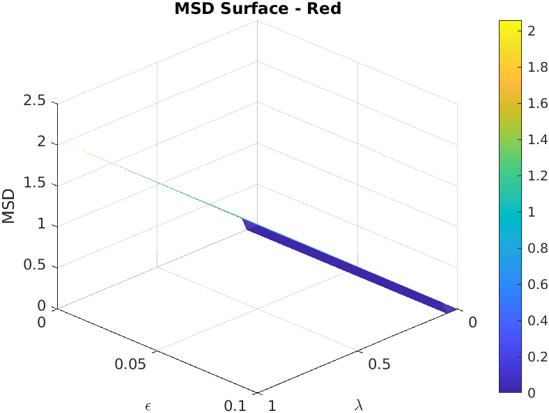
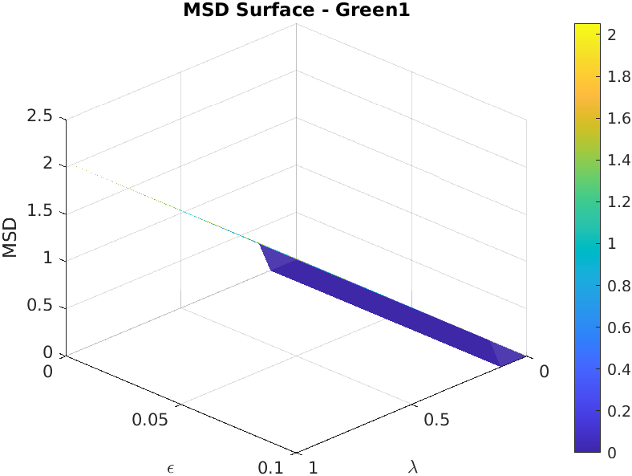
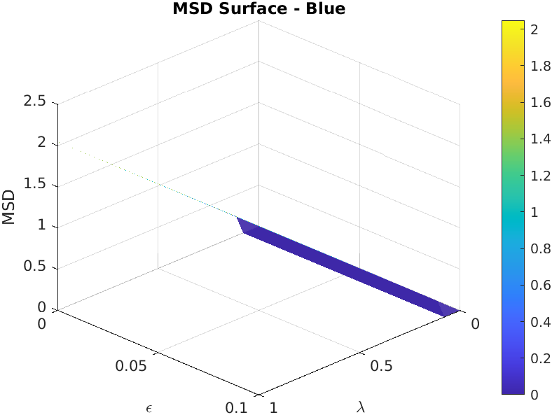

# Image Restoration using the ROF Model

Joel Maldonado · 2025-05-14

---

This repository implements the Rudin–Osher–Fatemi (ROF) total-variation denoising model, optimized for CPU/GPU hybrid execution and high-performance parameter sweeps. We apply ROF separately to each Bayer-mosaic color plane (R, G1, G2, B) and measure noise reduction via the Mean Square Difference (MSD).

---

## 🚀 Method

1. **Model & Discretization**
   We minimize the functional

   $$
   \mathcal{F}(u) = \int \sqrt{\epsilon^2 + |\nabla u|^2}\,dx\,dy
   + \frac{\lambda}{2}\int (u - f)^2\,dx\,dy
   $$

   via an **iterative** finite-difference scheme with Neumann boundary conditions. Each update is

   $$
   u^{n+1} = f \;-\;\lambda\,\nabla\!\cdot\!\Bigl(\tfrac{\nabla u^n}{\sqrt{\epsilon^2 + |\nabla u^n|^2}}\Bigr),
   $$

   and we stop when the relative change $\|u^{n+1}-u^n\|/\|u^n\|<10^{-4}$.

2. **Vectorized CPU / GPU Solver**

   * **CPU**: casts to `double`, batches parameter grids in memory-safe blocks (`cpu_plane_sweep.m`), and uses `parfor`.
   * **GPU**: casts to `single`, broadcasts 4D stacks of $(\lambda,\epsilon)$ via `gpuArray` chunks (`gpu_plane_sweep.m`), resets the device each chunk to avoid OOM.

3. **Quality Metric (MSD)**

   $$
   \text{MSD}(f,\lambda,\epsilon)
   =\sqrt{\frac1{HW}\sum_{i,j}(u_{i,j}-f_{i,j})^2},
   $$

   computed in `calculate_msd.m`.

---

## 🎨 Qualitative Examples

### Checkerboard Denoising


### Sinusoidal + High Gaussian Noise


### Noise-Free Gradient


---

## 🔍 Hyperparameter Grid Montages

We swept
$\lambda\in\{0.1,0.3,0.5,1.0,2.0\}$
$\epsilon\in\{10^{-4},2\times10^{-3},5\times10^{-3},10^{-2},2\times10^{-2}\}$

|                        Gradient Grid                        |                        Sinusoidal Grid                       |                         Checkerboard Grid                        |
| :---------------------------------------------------------: | :----------------------------------------------------------: | :--------------------------------------------------------------: |
|  |  |  |

---

## 📊 MSD Surfaces Across Color Planes


*Vertical offsets added for clarity.*

---

## 📈 Color-Plane Noise Comparison

Each plane’s MSD surface (viewed at 135°×30°):

|                                   Red                                   |                                   Green1                                  |
| :---------------------------------------------------------------------: | :-----------------------------------------------------------------------: |
|  |  |

|                                   Green2                                  |                                    Blue                                   |
| :-----------------------------------------------------------------------: | :-----------------------------------------------------------------------: |
|  |  |

---

## 🔑 Key Findings

1. **Green channels (G1, G2)** consistently have the **lowest MSD** → *least noise*.
2. **Red & Blue** exhibit **higher MSD** → *more noise*.
3. This validates the Bayer mosaic’s two-green design: oversampled luminance yields lower variance in green.

---

## 📂 Structure & Usage

```
/
├─ smooth_image_rof.m       # ROF solver (CPU/GPU adaptive)
├─ calculate_msd.m          # MSD computation over λ×ε grid
├─ cpu_plane_sweep.m        # CPU batching logic
├─ gpu_plane_sweep.m        # GPU batching logic
├─ foreach_plane_search.m   # Applies grid search to each color plane
├─ utils/
│   ├─ results/
│   │   ├─ test_images/         # Visual test outputs
│   │   ├─ test_grid_5x5/       # 5×5 λ×ε montages
│   │   └─ msd_surfaces/        # Multi-angle MSD surfaces
└─ test/
    └─ ...                     # Automated precision & memory tests
```

### Running

```matlab
% Denoise a plane on CPU or GPU:
u = smooth_image_rof(f, [0.1 1 10], [1e-4 1e-3], 300, 0.25);

% Compute MSD over grid:
msd = calculate_msd(f, [0.1 1 10], [1e-4 1e-3], 300, 0.25);

% Full pipeline on all 4 Bayer planes:
Iplanar = raw2planar(rawread('images/DSC00099.ARW'));
results = foreach_plane_search(Iplanar, ...
    struct('lambdaRange',[1e-3 1],'epsilonRange',[1e-4 1e-1],'coarseN',10,'refineN',10,'halfDecades',1), ...
    struct('nIter',300,'dt',0.25));
```

---

## 🏷️ License & Citation

Please cite:

> Joel Maldonado, *Image Restoration using the ROF Model*, 2025.
> L. Rudin, S. Osher, E. Fatemi, “Nonlinear total variation based noise removal algorithms,” *Physica D*, 1992.

---

Enjoy exploring ROF denoising at scale!
